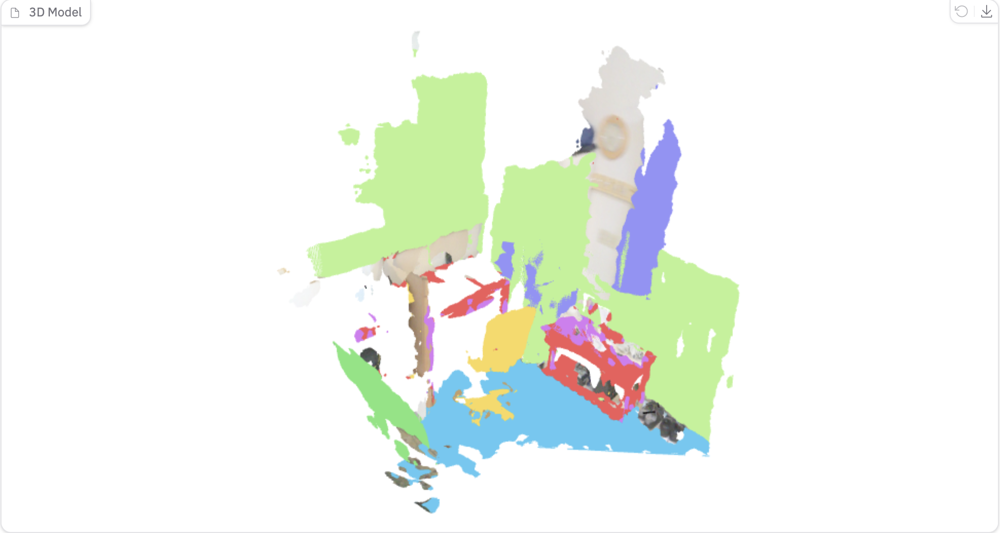
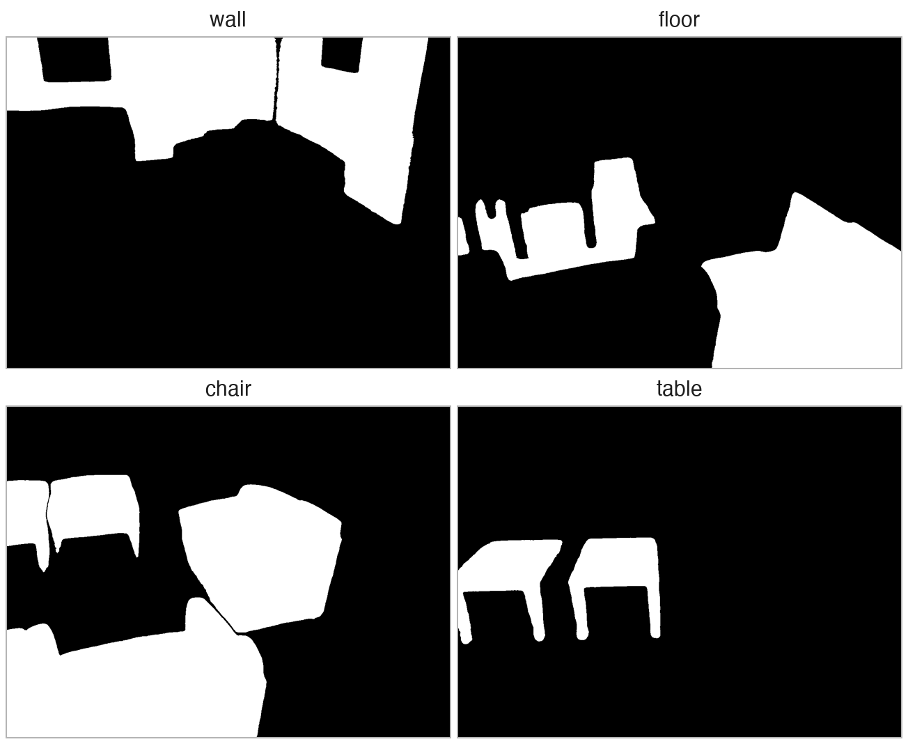
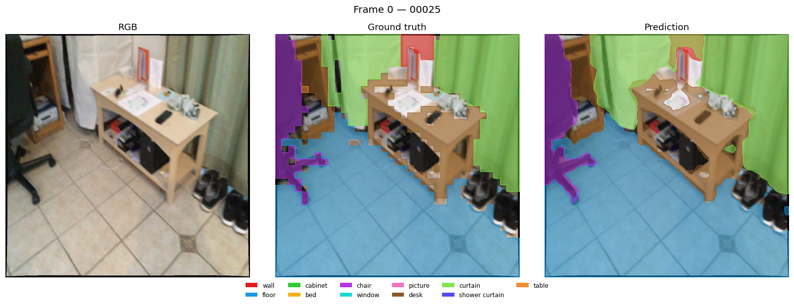
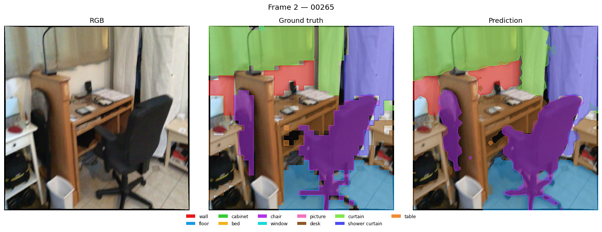
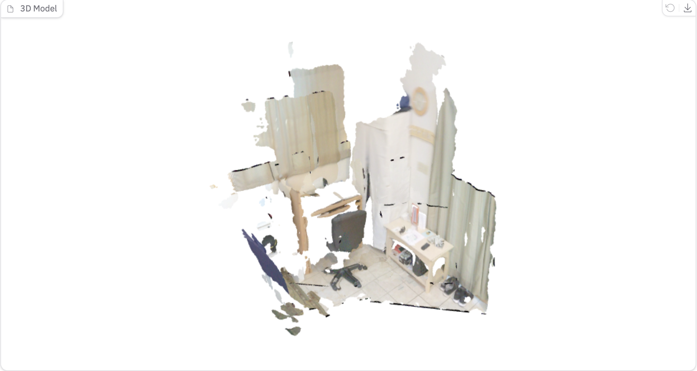
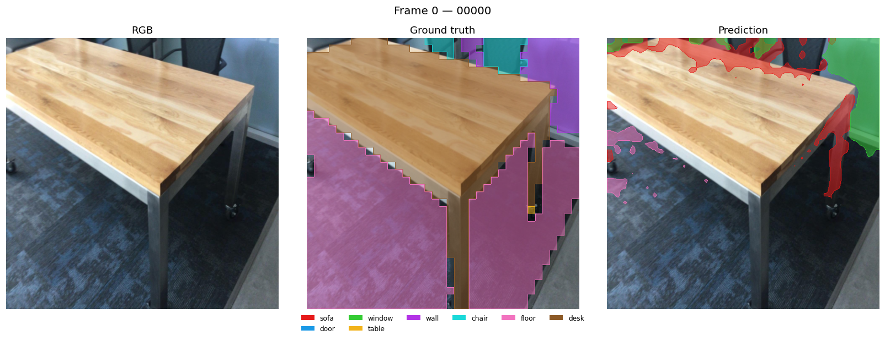

<!-- _class: lead -->
<!-- _paginate: false -->

# Multi-View Consistent 3D Instance Segmentation on a Frozen VGGT Backbone

## A D4RT-style / DETR-like decoder trained on SAM3 pseudo-labels (ScanNet)

**Nico Iacobone — Research update for supervision meeting**
June 11, 2026

<!--
Speaker notes:
One-sentence framing: we keep VGGT-1B (CVPR'25 feed-forward 3D reconstruction) completely frozen and attach a lightweight (~6.5M param) DETR-like decoder that produces multi-view consistent instance segmentation masks, supervised by SAM3 pseudo-labels on ScanNet. The background image is the actual output: VGGT's point cloud colored by predicted instances.
-->

---

# 1 · Data & Supervision: ScanNet + SAM3 Pseudo-Labels

- For each scene a subset of ~100 images is selected; each frame is sampled 5 frames after the preceding one
- SAM3 is run on every frame, once per class: the result is one binary mask per class per frame (19 ScanNet classes, 0 is background)
- All masks of the same class are linked into a single instance, consistent across all views; each instance also receives a centroid point, used as its query prompt
- **Limitation:** binary per-class masks cannot separate two objects of the same class — a property of the data, not of the model

SAM3 per-class binary masks, one frame of `scene0001_00`

<!--
Speaker notes:
Two practical pitfalls encoded in the loader: (1) sampling from the raw folder silently yields frames without masks — the loader uses the preprocessed subset; (2) cross-view identity: an early version created one instance per (frame, class) pair, which made multi-view consistency meaningless — fixed to one global ID per class. Be explicit: the per-class binary format is a data limitation, not a model one — the decoder is already instance-capable. The semantic vs instance vs panoptic decision must be made BEFORE the big SAM3 preprocessing run (discussion slide).
-->

---

<!-- _class: compact -->

# 2 · The Decoder: Point-Prompted Queries → Multi-View Masks

The head reads a single tensor out of the frozen VGGT: the output of its last aggregator layer, i.e. the multi-view-fused features of all input frames. On top of it, the decoder turns *point prompts* into instance masks.

**A query is a point prompt:** a position (u, v) in one specific view. It is made of three pieces, summed into one vector:

- a **Fourier positional encoding of (u, v)** — tells the decoder *where* in the image the prompt sits
- a **learned view embedding** — tells it *which frame* the prompt belongs to; position alone is ambiguous when several views see the same scene
- a **small MLP on the 9×9 RGB patch around the point** — tells it *what the point locally looks like*, so the query can bind to one specific object

**Instance decoder:** a standard 4-layer, 8-head transformer decoder. The VGGT features of all frames, projected to 256 dimensions and normalized, form the *memory*; the queries form the *target sequence* (tgt — the sequence the decoder refines layer by layer, alternating self-attention among queries and cross-attention into the memory). After decoding, the original query is added back to the output.

**Output heads:** a classification head (19 classes + background) and a mask head — each query produces a small mask kernel that is compared by cosine similarity with the per-pixel features of *every* frame. One query therefore emits one mask spanning all frames: multi-view consistency holds by construction.

<!--
Speaker notes:
Design intent of the query: position alone is ambiguous across views — the view embedding routes it to the right frame and the RGB patch disambiguates locally. Queries are points, not learned object slots; coordinates are inputs, not predictions. The structural point: cross-view consistency is NOT enforced by a loss — the memory contains all frames jointly and a single query emits a single mask tensor over all frames, so the same query IS the same instance everywhere. LayerNorm on the memory, the query skip connection and the cosine logits were each required for training to work at all (raw VGGT features have huge magnitudes).
-->

---

<!-- _class: compact -->

# 3 · Matching & Losses

Training follows DETR-style set prediction: queries and ground-truth instances are matched one-to-one by the Hungarian algorithm, with a cost combining class probability, query-point distance and a dense mask cost. Each matched pair is then supervised with three losses:

- **Focal classification loss** — a cross-entropy that down-weights examples the model already gets right. Chosen because background queries vastly outnumber object queries: it keeps the few informative ones from being drowned out.
- **Dice mask loss** — measures the overlap between predicted and ground-truth mask, normalized by their sizes. Chosen because it is insensitive to the foreground/background pixel imbalance and optimizes the global shape of the mask, directly IoU-like.
- **Weighted binary cross-entropy mask loss** — per-pixel supervision with extra weight on foreground pixels. It complements Dice with precise, local gradients and prevents the trivial "everything is background" solution.

In a second phase of the project a *no-object* term was added: unmatched queries receive a small classification loss toward the background class. The model learns to answer "nothing here" — which is what makes inference without ground-truth prompts possible.

<!--
Speaker notes:
The matcher cost is mask-aware (Dice+BCE on the dense masks, Mask2Former-style), so each GT instance is assigned to the query that already explains it best. The no-object term was the single most impactful late change: before it, background queries confidently predicted foreground, crushing AP and making inference impossible without GT-ordered queries. With it, roughly two thirds of grid queries correctly self-classify as background and get filtered out.
-->

---

# 4 · Training Setup

Training the head is cheap: a full 1000-epoch run takes about 2 minutes on a single GPU.

- AdamW, learning rate 2e-3, linear warmup (30 epochs) then cosine decay; gradient clipping
- **Regularization:** 3 frame bundles per scene (random frame re-sampling) · query jitter σ = 0.02 · color jitter 0.2 · background queries resampled at every step
- **Model selection:** validation mIoU is measured every 50 epochs and the best checkpoint is kept; optional early stopping

<!--
Speaker notes:
Why it's so cheap: the frozen backbone runs only once per scene bundle up front (~20 s total); every epoch trains only the ~6.5M-parameter head. The augmentation had to be cache-compatible: color jitter is applied before the backbone pass (one draw per bundle), query jitter is backbone-free so it is applied per step. The 2-minute run time is why architecture decisions converged quickly — and why the scaling experiment is logistically trivial once data exists.
-->

---

# 5 · Quantitative Results

The pipeline demonstrably works (overfit ✓, multi-scene fit ✓, unprompted ≈ prompted ✓); generalization is data-limited at 4 training scenes, exactly as expected.

| Experiment | mIoU | AP50 | class_acc | Note |
|---|---|---|---|---|
| Single-scene overfit (400 epochs) | 0.004 → **0.900** | 0.96 | 1.00 | gradient-flow sanity ✓ |
| 4-scene training, fixed batch (mean) | **0.967** | 0.54 | 0.94 | AP hurt by no bg supervision |
| — held-out scene (final ckpt) | 0.027 | 0.00 | 0.29 | peaked ~0.13 mid-training |
| 4-scene + regularization, prompted (mean) | 0.666 | **0.771** | 0.875 | AP50 0.54 → 0.77 via no-object loss |
| 4-scene + regularization, **unprompted** (mean) | **0.678** | 0.446 | — | ≈ prompted mIoU, **zero GT at test time** |
| — held-out scene, best ckpt | **0.138** @ ep 450 | — | — | > 0.027 via model selection |

- **Prompted** = queries at GT centroids · **Unprompted** = uniform 6×6 grid per frame, background-argmax filtered — the honest detection number

<!--
Speaker notes:
Three headline claims: (1) one set of weights represents four scenes — mean train mIoU 0.967 in the fixed-batch setting; (2) unprompted inference works — grid queries match prompted mIoU (0.678 vs 0.666) with zero GT; the no-object head suppresses ~200 of 288 grid queries; (3) generalization is bounded by N=4 scenes — best val mIoU 0.138; the val gain comes from regularization + checkpoint selection, not real generalization. Pre-empt the question: train mIoU "dropping" 0.97 → 0.67 with regularization is expected — augmentation removed the fixed memorizable batch. Unprompted AP50 trails because duplicate grid detections count as false positives (no NMS yet).
-->

---

# 6 · Qualitative Results: 2D, Cross-View Consistent

Result after **overfitting on this single scene** and validating on the same scene (RGB | SAM3 ground truth | prediction). The same instance keeps the same color in every frame:

<!--
Speaker notes:
Each strip is RGB | SAM3 ground truth | prediction at the 37×37 patch grid, upsampled. The point to make: objects keep their instance color between the two frames — that's the multi-view consistency claim made visible in 2D. Mask boundaries are blocky because evaluation and prediction live on the patch grid. More frames available in visualizations/meeting_jun_11 as backup.
-->

---

# 7 · Qualitative Results: 3D

Model **overfitted on 4 scenes**; the bottom row shows the 5th, held-out validation scene.

VGGT reconstruction (RGB)

Same point cloud, colored by **predicted instance**

**5th held-out validation scene** (never seen in training): mostly background / wrong classes — the gap the scaling experiment must close.

<!--
Speaker notes:
Top: the gradio demo with "Color By: Predicted Instances" — a wall that is one color across all viewpoints is multi-view consistency made visible, no metric needed. Bottom: the val scene at 4 training scenes fails as the 0.138 mIoU predicts. This motivates the scaling experiment; it is not a surprise.
-->

---

<!-- _class: compact -->

# 8 · Limitations, Open Questions & Next Steps

**Limitations**
- Per-class binary SAM3 masks → can't separate same-class objects ("semantic-as-instance" ceiling)
- 37×37 mask resolution; no full-res upsampling yet
- Duplicate grid detections (no NMS) depress unprompted AP
- 5 scenes → no generalization claim yet

**Open questions**
1. **Label format for the next SAM3 run:** semantic vs. instance vs. panoptic? — *blocks the preprocessing pipeline*
2. Point prompts vs. **learned object queries** — when to switch?

**Next steps**
1. **Preprocess tens → hundreds of scenes** with SAM3 (after the label-format decision) — *the only blocker*
2. **Scaling experiment:** N ∈ {10, 25, 50, 100+}, held-out val, early stopping — *does held-out mIoU climb with N?* (N = 4: **0.138**)
3. Ablations once val signal > noise: no-object weight · augmentation · grid density (+ NMS)
4. Then: learned queries · mask upsampling · partial unfreezing

<!--
Speaker notes:
Open question 1 is genuinely blocking: SAM3 preprocessing of hundreds of scenes is expensive, so per-class vs per-instance must be decided first. Question 2 has a natural decision point — if grid duplicates persist after scaling, learned queries solve detection and dedup at once but abandon the point-prompt framing. End on the ask: support/compute for preprocessing + the label-format decision. Everything else is in place and regression-tested; scaling requires zero code changes, just scene lists.
-->
