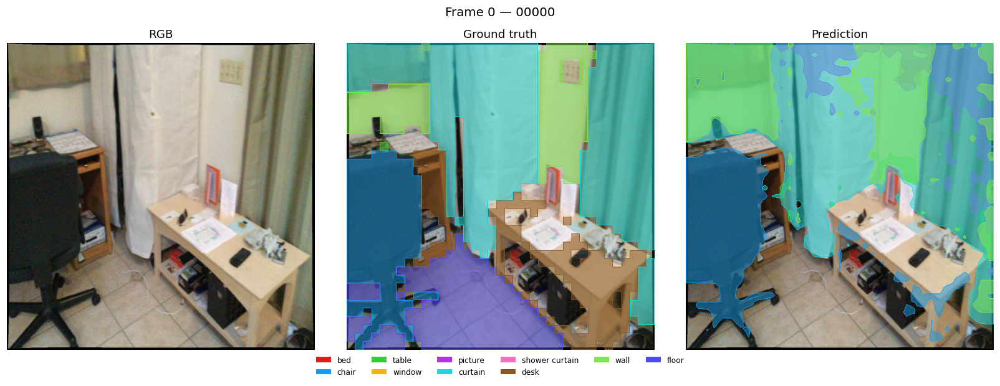
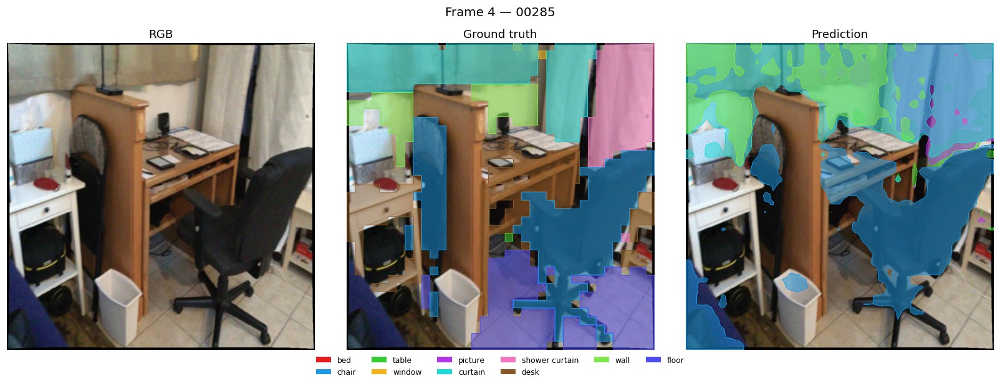

<!-- _class: lead -->
<!-- _paginate: false -->

# Multi-View Consistent 3D Instance Segmentation on a Frozen VGGT Backbone

## A D4RT-style / DETR-like decoder trained on SAM3 pseudo-labels (ScanNet)

**Nico Iacobone — Research update for supervision meeting**
June 11, 2026


<!--
Speaker notes:
One-sentence framing: we keep VGGT-1B (CVPR'25 feed-forward 3D reconstruction) completely frozen and attach a lightweight (~6.5M param) DETR-like decoder that produces multi-view consistent instance segmentation masks, supervised by SAM3 pseudo-labels on ScanNet. Two milestones are complete: a validated end-to-end prototype (M1), and a regularized, unprompted-capable training loop (M2). The scaling experiment is the next step and is blocked only on data. The background image is the actual output: VGGT's point cloud colored by predicted instances.
-->

---

# 1 · Goal & Motivation

**Key message:** Reuse VGGT's fused multi-view 3D representation as a free feature extractor — only train a small segmentation decoder on top.

- VGGT (CVPR 2025): feed-forward multi-view transformer; its aggregator alternates per-frame and **global cross-frame attention** → features are already multi-view fused
- **Hypothesis:** those global features suffice for **cross-view-consistent instance segmentation** without touching the backbone
- Approach: D4RT-style **point-prompted queries** + DETR-like set prediction + Mask2Former-style dense masks
- Supervision: **SAM3 masks on ScanNet** — pseudo-labels, no manual annotation

```
images [S×518×518] → frozen VGGT-1B (1.26B params, no_grad)
                       └─ global features F [B,S,P,2048]
                            → trainable head (~6.5M params)
                                 → per-query class + mask over ALL frames
```

<!--
Speaker notes:
Emphasize the research bet: if VGGT's global attention already solves correspondence, segmentation identity should transfer across views "for free" — the decoder only has to read it out. This is also why everything stays frozen: it tests the representation, keeps training cheap (minutes), and makes results attributable to the decoder. D4RT inspiration = queries are (u,v,view) point prompts; DETR inspiration = set prediction with Hungarian matching and (since M2) a no-object class.
-->

---

# 2 · Data & Supervision: ScanNet + SAM3 Pseudo-Labels

<div class="cols">
<div>

- 5 preprocessed scenes; **~100 masked stride-5 frames** each (of >5500 raw)
- SAM3 run per class → one **binary PNG per ScanNet class** per frame (19 classes, 0 = background)
- Loader assigns one **global, cross-view-consistent instance ID per class** + a centroid prompt per instance
- **Limitation:** per-class binary masks can't separate two chairs → "semantic-as-instance" ceiling (data, not model)
- Preprocessing cost = the current **scaling bottleneck**

</div>
<div>


<span class="small">SAM3 per-class binary masks, one frame of `scene0001_00`</span>

</div>
</div>

<!--
Speaker notes:
Two practical pitfalls encoded in the loader: (1) sampling from color/ silently yields frames without masks — the loader uses subset/; (2) cross-view identity: an early version created one instance per (frame, class) pair, which made multi-view consistency meaningless — fixed to one global ID per class (scene0000_00: 32 → 11 true cross-view instances). Be explicit: the per-class binary format is a data limitation, not a model one — the decoder is already instance-capable. The semantic vs instance vs panoptic decision must be made BEFORE the big SAM3 preprocessing run (discussion slide).
-->

---

# 3 · Hook Point: Global Scene Features from VGGT

**Key message:** One tensor is read out of VGGT — nothing else changes; the backbone is byte-identical to upstream and never sees gradients.

- Aggregator: 24 blocks alternating **frame attention** (`[B·S, P, C]`) and **global attention** (`[B, S·P, C]`), C = 1024
- Hook: last cached layer, frame ‖ global concatenated → **F : [B, S, P, 2048]**
- P = **37×37 patch tokens** + 1 camera + 4 register tokens (`patch_start_idx` separates them)
- Head consumes F under `torch.no_grad()`

```
frame 1 ─┐                                      ┌─ camera head   (upstream)
frame 2 ─┤→ [24 × (frame attn ⇄ global attn)] ──┼─ depth head    (upstream)
  ...    │             │ hook: layer 23         └─ point head    (upstream)
frame S ─┘             ▼
              F [B,S,P,2048] ──→  D4RT segmentation head  (this project)
```

<!--
Speaker notes:
Why the last layer: it is the most fused multi-view representation, and it's what VGGT's own dense heads (depth/point) consume — so spatial detail demonstrably survives to this depth. Camera/register tokens are kept in the cross-attention memory but excluded from dense mask features (only patch tokens map to pixels). Foreshadow: the raw magnitude of these features is enormous — caused the single hardest bug of the project (slide 6).
-->

---

# 4 · The Decoder: Point-Prompted Queries → Multi-View Masks

**Key message:** A query is a *point prompt* — where (u,v), which view, what it locally looks like. One query → one mask spanning **all** frames → consistency by construction.

**QueryGenerator** → `[B, N, 256]`
`query = pos(Fourier(u,v)) + view_embed[view_id] + MLP(9×9 RGB patch)`

**InstanceDecoder** (`nn.TransformerDecoder`, 4 layers × 8 heads)
- memory: F flattened `[B, S·P, 2048]` → linear → 256 → **LayerNorm** ← essential
- queries = tgt; then **query skip connection** ← essential (prevents collapse)

**Output heads**
- `class_head` → `[B, N, 20]` (19 classes + background at index 0)
- `mask_embed_head` → per-query kernel; mask logit = **cosine(kernel, pixel feature) × learnable τ + bias** → `pred_masks [B, N, S, 37, 37]`

<!--
Speaker notes:
Design intent of the query: position alone is ambiguous across views — the view embedding routes it to the right frame and the RGB patch disambiguates locally. This is the D4RT flavor: queries are points, not learned object slots; coordinates are inputs, not predictions (no coordinate loss). The structural point for a CV audience: cross-view consistency is NOT enforced by a loss — the memory contains all frames jointly and a single query emits a single mask tensor over all frames, so the same query IS the same instance everywhere. The highlighted choices (LayerNorm, skip, cosine) were each required for training to work at all — story in two slides.
-->

---

# 5 · Matching & Losses

**Key message:** DETR-style set prediction: mask-aware Hungarian matching, then Focal + Dice + weighted BCE; since M2, unmatched queries are pushed to *background*.

- **PointBipartiteMatcher** cost = class (1−p) + coordinate L2 + **dense Dice+BCE mask cost** → `linear_sum_assignment`
- **D4RTLoss** on matched pairs:
  - class: **Focal** (α = 0.25, γ = 2.0)
  - mask: **Dice + BCE with foreground `pos_weight`** (capped at 20)
- **No-object loss (M2):** unmatched queries get class loss toward background, down-weighted by `no_object_weight = 0.1` (DETR's `eos_coef`); mask loss stays matched-only
- Coordinates enter the matching cost but carry **no loss term** (queries are prompts, not predictions)
- Default off → Milestone-1 behavior is bit-identical; all old tests pass unchanged

<!--
Speaker notes:
The no-object loss was the single most impactful M2 change: in M1, background queries confidently predicted foreground, crushing AP (0.54 AP50 despite 0.97 mIoU) and making inference impossible without GT-ordered queries. With it, ~2/3 of grid queries correctly self-classify as background and get filtered, enabling unprompted inference. "New options default to previous behavior" is the project's regression convention.
-->

---

# 6 · Hard-Won Lesson: the Query-Collapse Bug

**Key message:** Raw VGGT features nearly killed the project — three small changes were the difference between mIoU 0 and 0.90.

- **Symptom:** loss ↓ steadily, **mIoU stuck at 0**; every query produced the *same* mask
- **Diagnosis:** queries (std ≈ 2) → identical decoded vectors (std ≈ 0) — decoder output collapse
- **Cause:** un-normalized VGGT memory has huge magnitude → cross-attention output swamps the query residual stream
- **Fixes:** LayerNorm on projected memory · query skip connection · cosine mask logits (sigmoid saturation) · fg `pos_weight` · grad clipping
- An earlier embedding-L2 proxy loss had *hidden* the bug (it supplied distinct targets per query)

> Transferable lesson: when grafting heads onto foundation-model features, **feature statistics are part of the interface** — and a falling loss alone proves nothing.

<!--
Speaker notes:
Worth a full slide because it's the transferable lesson. Also a methodology lesson — the proxy loss made everything look fine; only the real dense mask loss exposed the collapse. The diagnostic that found it (per-layer std instrumentation) is cheap and reusable. These constraints are documented in CLAUDE.md as "violating these silently breaks training."
-->

---

# 7 · Training Setup

**Key message:** Frozen-backbone feature caching makes a full 1000-epoch run cost ~2 minutes on one GPU — iteration is effectively free.

- **Cache once, train fast:** backbone runs once per scene-bundle up front (~20 s for 13 bundles); every epoch trains only the 6.5M-param head → 1000 epochs ≈ **2.2 min** (RTX 4090)
- AdamW, lr 2e-3, linear warmup (30 ep) → cosine decay; gradient clipping
- **Regularization (M2):** 3 bundles/scene (random frame re-sampling) · query jitter σ = 0.02 · color jitter 0.2 · background queries resampled per step
- **Model selection (M2):** val prompted mIoU every 50 epochs → `checkpoint_best.pth`; optional early stopping
- `--cache_device cpu`: bundles (~90 MB each) live in host RAM → scene count not GPU-bound
- Self-contained checkpoints: head weights + config + scene bundles + optimizer state

<!--
Speaker notes:
The caching design is what makes the methodology work: augmentation had to be cache-compatible (color jitter applied BEFORE the backbone pass, one draw per bundle; query jitter is backbone-free so per-step). Trade-off acknowledged: photometric diversity is one draw per bundle. The 2-minute run time is why architecture decisions converged quickly — and why the scaling experiment is logistically trivial once data exists.
-->

---

# 8 · Quantitative Results

**Key message:** The pipeline demonstrably works (overfit ✓, multi-scene fit ✓, unprompted ≈ prompted ✓); generalization is data-limited at 4 training scenes, exactly as expected.

<div class="small">

| Experiment | mIoU | AP50 | class_acc | Note |
|---|---|---|---|---|
| M1 single-scene overfit (400 ep) | 0.004 → **0.900** | 0.96 | 1.00 | gradient-flow sanity ✓ |
| M1 4-scene train (mean) | **0.967** | 0.54 | 0.94 | AP hurt by no bg supervision |
| M1 held-out scene (final ckpt) | 0.027 | 0.00 | 0.29 | peaked ~0.13 mid-training |
| M2 4-scene, prompted (mean) | 0.666 | **0.771** | 0.875 | AP50 0.54 → 0.77 via no-object loss |
| M2 4-scene, **unprompted** (mean) | **0.678** | 0.446 | — | ≈ prompted mIoU, **zero GT at test time** |
| M2 held-out, best ckpt | **0.138** @ ep 450 | — | — | > M1 final (0.027) via model selection |

</div>

- **Prompted** = queries at GT centroids · **Unprompted** = uniform 6×6 grid per frame, background-argmax filtered — the honest detection number

<!--
Speaker notes:
Three headline claims: (1) one set of weights represents four scenes — M1 mean train mIoU 0.967; (2) unprompted inference works — grid queries match prompted mIoU (0.678 vs 0.666) with zero GT; the no-object head suppresses ~200 of 288 grid queries; (3) generalization is bounded by N=4 scenes — best val mIoU 0.138; the M1→M2 val gain comes from regularization + checkpoint selection, not real generalization. Pre-empt the question: train mIoU "dropping" 0.97 → 0.67 in M2 is expected — augmentation removed the fixed memorizable batch. Unprompted AP50 trails because duplicate grid detections count as false positives (no NMS yet).
-->

---

# 9 · Qualitative Results: 2D, Cross-View Consistent

**Same instance → same color in every frame** (4-scene model, train scene; RGB | SAM3 GT | prediction):




<!--
Speaker notes:
Each strip is RGB | SAM3 ground truth | prediction at the 37x37 patch grid upsampled. The point to make: the desk/chair/wall keep their instance color between frame 0 and frame 4 — that's the multi-view consistency claim made visible in 2D. Mask boundaries are blocky because evaluation and prediction live on the 37×37 patch grid (slide 11 limitation). More scenes available in visualizations/meeting_jun_11 as backup.
-->

---

# 10 · Qualitative Results: 3D — and the Honest Failure Case

<div class="cols">
<div>


<span class="small">VGGT reconstruction (RGB)</span>

</div>
<div>


<span class="small">Same point cloud, colored by **predicted instance**</span>

</div>
</div>


<span class="small">**Held-out scene** (never trained on): mostly background / wrong classes — the gap the scaling experiment must close.</span>

<!--
Speaker notes:
Top: demo_gradio.py with "Color By: Predicted Instances" — a wall that is one color across all 8 viewpoints is multi-view consistency made visible, no metric needed. Bottom: honesty slide-within-a-slide — the val scene at N=4 training scenes fails as the 0.138 mIoU predicts. This is the motivation for the scaling experiment, not a surprise.
-->

---

<!-- _class: compact -->

# 11 · Limitations, Open Questions & Next Steps

<div class="cols">
<div>

**Limitations**
- Per-class binary SAM3 masks → can't separate same-class objects ("semantic-as-instance" ceiling)
- 37×37 mask resolution; no full-res upsampling yet
- Duplicate grid detections (no NMS) depress unprompted AP
- 5 scenes → no generalization claim yet

**Open questions**
1. **Label format for the next SAM3 run:** semantic vs. instance vs. panoptic? — *blocks the preprocessing pipeline*
2. Point prompts vs. **learned object queries** — when to switch?
3. Scenes needed before partial backbone unfreezing?
4. Target benchmark/baseline for a paper?

</div>
<div>

**Next steps**
1. **Preprocess tens → hundreds of scenes** with SAM3 (after the label-format decision) — *the only blocker; training is ~2 min/run*
2. **Scaling experiment:** N ∈ {10, 25, 50, 100+}, held-out val, early stopping — *does held-out mIoU climb with N?* (N = 4: **0.138**)
3. Ablations once val signal > noise: no-object weight · augmentation · grid density (+ NMS)
4. Then: learned queries · mask upsampling · partial unfreezing

**Proposal:** label format this week → 25-scene batch → N = {10, 25} within a day of data.

</div>
</div>

<!--
Speaker notes:
Slow down here. Open question 1 is genuinely blocking: SAM3 preprocessing of hundreds of scenes is expensive, so per-class vs per-instance must be decided first. Question 2 has a natural decision point — if grid duplicates persist after scaling, learned queries solve detection and dedup at once but abandon the D4RT point-prompt framing. Question 4 is positioning: prompted mode resembles interactive segmentation (SAM-style, multi-view consistent); unprompted resembles 3D instance segmentation — which story do we tell? End on the ask: support/compute for preprocessing + the label-format decision. Everything else is in place and regression-tested; scaling requires zero code changes, just scene lists.
-->
